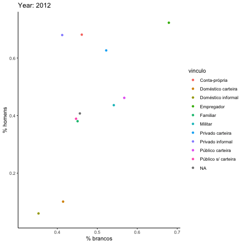

<!-- README.md is generated from README.Rmd. Please edit that file -->

# pnadc

<!-- badges: start -->

[](https://www.tidyverse.org/lifecycle/#experimental)
<!-- badges: end -->

O objetivo desse pacote é automatizar algumas análises feitas com os
microdados da PNAD Contínua.

> Ainda em fase MEGA-EXPERIMENTAL. A API VAI MUDAR

## Instalação

``` r
install.packages("pnadc")
```

## Como usar

O pacote foi pensado para que poassa ser usadao assim:

### Ler dados da PNAD Continua

Há funções de utilidade para baixar os dados da PNAD e para extrair os
arquivos.

``` r
library(pnadc)
# Vai baixar numa pasta "dados" na raiz do projeto.
# Isso não vai ser possível de alterar pelo pacote para dar uma 
# estrutura de trabalho homogênea e que possa ser confiada
download_pnad(2019, 4)
unzip_pnad(2019, 4)
```

Assim como para leitura dos dados com as variaveis padronizadas.

``` r
pnad2019_4 <- ler_pnad(2019, 4)
#> Warning: NAs introduzidos por coerção

#> Warning: NAs introduzidos por coerção

#> Warning: NAs introduzidos por coerção

#> Warning: NAs introduzidos por coerção

#> Warning: NAs introduzidos por coerção
```

### Funções de utilidade

A PNAD é uma pesquisa estratificada e em geral é analisada usando o
pacote `survey`. Mas esse pacote é muito lento para realizar alguns
cálculos e principalemente para fazer análises exploratórias.

``` r
pnad2019_4 %>% 
  # Na verdade um contador respeitando os pesos
  participacao(sexo)
#> # A tibble: 1 x 2
#> # Groups:   sexo [1]
#>   sexo  participacao
#>   <chr>        <dbl>
#> 1 <NA>           NaN

# Deve funcionar com group_by
# Ainda não funciona
library(dplyr)
#> Warning: package 'dplyr' was built under R version 3.5.2
#> 
#> Attaching package: 'dplyr'
#> The following objects are masked from 'package:stats':
#> 
#>     filter, lag
#> The following objects are masked from 'package:base':
#> 
#>     intersect, setdiff, setequal, union
pnad2019_4 %>% 
  group_by(vinculo_primario) %>% 
  participacao(sexo)
#> # A tibble: 1 x 3
#> # Groups:   sexo [1]
#>   vinculo_primario sexo  participacao
#>   <chr>            <chr>        <dbl>
#> 1 <NA>             <NA>           NaN

pnad2019_4 %>% 
  tidyr::nest(data = -vinculo_primario) %>%
  mutate(prop = purrr::map(data, participacao, sexo)) %>% 
  select(-data) %>% 
  tidyr::unnest(prop)
#> # A tibble: 1 x 3
#>   vinculo_primario sexo  participacao
#>   <chr>            <chr>        <dbl>
#> 1 <NA>             <NA>           NaN
```

\`\`\`

O ideal era que essas funções de utilidade não se contivessem apenas a
dados relativos mas também fossem capazes de somar totais.

``` r
pnad2019_4 %>% 
  # Na verdade um somador respeitando os pesos e as projeções de pop
  total(sexo)

# Deve funcionar com group_by
pnad2019_4 %>% 
  grou_by(regiao) %>% 
  total(sexo)
```

O pacote possibilita fazer coisas como

``` r
pnad <- tibble::tibble(
  ano = c(rep(2012:2019, each = 4), 2020),
  trimestre = rep(1:4, length.out = 33)
) %>%
  mutate(dado = purrr::map2(ano, trimestre, ler_pnad)) %>% 
  pull(dado) %>% 
  map_df(~nest(.x, dado = -c(ano, trimestre, vinculo_primario)))

mais_comum <- function(x) {
  resp <- sort(table(x), decreasing = TRUE)
  if (length(resp) == 0) return("")
  names(resp)[[1]]
}

estats <- pnad %>% 
  group_by(ano, trimestre, vinculo_primario) %>%
  mutate(
    brancos = map_dbl(dado, ~weighted.mean(.x$cor == 1, .x$peso_posestrat, na.rm = TRUE)),
    homens = map_dbl(dado, ~weighted.mean(.x$sexo == 1, .x$peso_posestrat, na.rm = TRUE)),
    idade = map_dbl(dado, ~weighted.mean(.x$idade, .x$peso_posestrat, na.rm = TRUE)),
    renda = map_dbl(dado, ~weighted.mean(.x$rendimento_primario, .x$peso_posestrat, na.rm = TRUE)),
    jornada = map_dbl(dado, ~weighted.mean(.x$jornada_principal, .x$peso_posestrat, na.rm = TRUE)),
    profissao = map_chr(dado, ~mais_comum(.x$profissao_principal)),
    vinculo = map_chr(vinculo_primario, ~case_when(
      .x == "01" ~ "Privado carteira",
      .x == "02" ~ "Privado informal",
      .x == "03" ~ "Doméstico carteira",
      .x == "04" ~ "Doméstico informal",
      .x == "05" ~ "Público carteira",
      .x == "06" ~ "Público s/ carteira",
      .x == "07" ~ "Militar",
      .x == "08" ~ "Empregador",
      .x == "09" ~ "Conta-própria",
      .x == "10" ~ "Familiar",
      TRUE ~ NA_character_
    )),
    periodo = ano + (trimestre - 1) / 4
  )

pontos <- ggplot(filter(estats, !is.na(periodo)), aes(brancos, homens, col = vinculo)) +
  geom_point() 
  
anim <- pontos +
  labs(title = 'Year: {ano}T{trimestre}', x = '% brancos', y = '% homens') +
  gganimate::transition_time(periodo) +
  gganimate::ease_aes('linear')

anim
```


